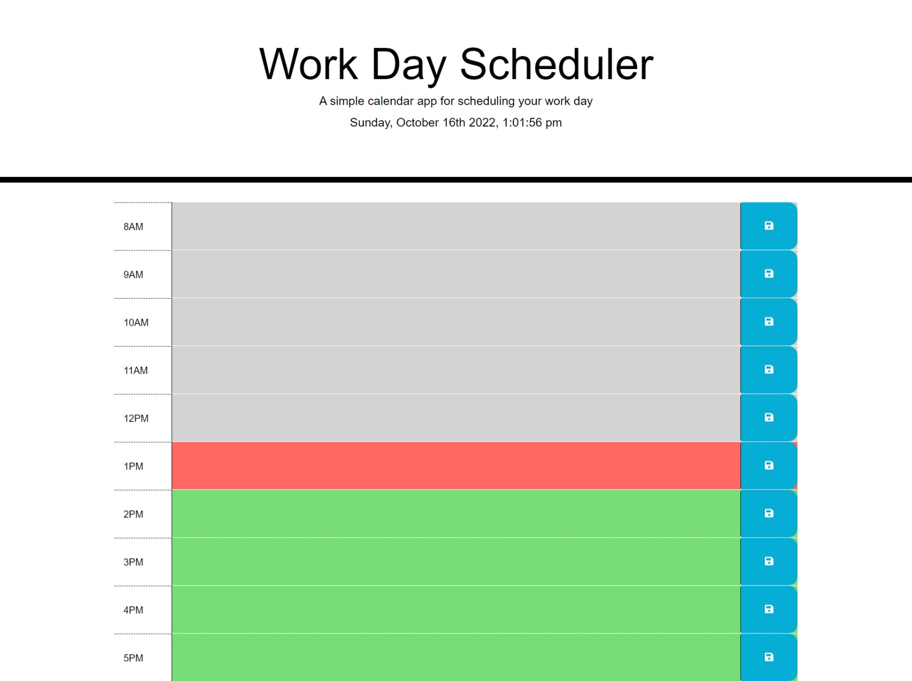

# 05 Third-Party APIs: Work Day Scheduler

## Description

This Work Day Scheduler is a simple calendar application that allows a user to save events for each hour of the 9am -5pm workday. This app will run in the browser and feature dynamically updated HTML and CSS powered by jQuery and Moment.js.

## Access

<!-- Deployed weblink-->

The Work Day Scheduler webpage can be accessed at the following URL...

https://lynnadelesadler.github.io/Sadler-Scheduling-Solutions/

The URL of the GitHub repository ...

https://github.com/lynnadelesadler/Sadler-Scheduling-Solutions

## Visuals

<!-- Provide the visuals for full display and phone display -->

This is how the deployed Work Day Scheduler website will look on a full display computer screen.

## Usage

<!-- Provide a list of steps on how to use the work day scheduler -->

- When a user opens the Work Day Scheduler the current date and time is displayed at the top of the calendar.

  - The date and time will continuously update on an open webpage.

- Timeblocks for standard 9am to 5pm business hours are available to document appointments and tasks.

- Each timeblock is color coded to indicate whether it is in the past, present, or future.

  - Grey represents the past.
  - Red represents the current hour timeblock.
  - Green represents the future.

- When a user clicks into a timeblock they can enter text to document an appointment or task.
  - A user should click the save icon located within the timeblock row to save the appointment/task typed into the timeblock.
  - When the save button is clicked a message will appear in the top header.

- All saved appointments/tasks typed into a timeblock is saved in local storage.

- If the page is refreshed the page the saved events persist.

---

_Here you will see a demonstration on how the Work Day Scheduler webpage works._

_In the beginning of the demonstration the time is 12:59:48 representing the present timeblock to be 12PM. This is a demonstration of the 12pm timeblock turning from present (red) to past (grey). The 1pm timeblock will turn from future (green) to present (red)._

_You will also be shown a new event typed into the 11AM timeblock. When the save button is clicked a message will show it was saved to local storage._

## Support

For help with this webpage please contact
|Name | Email |
|-----------|---------------------------|
|Lynn Sadler| lynnadelesadler@yahoo.com |

## Roadmap

Check back to this page as enhancements could be made for usability and optimized display.

## Authors and acknowledgment

HTML and CSS Sourcecode credit to be given to © 2022 Trilogy Education Services, LLC, a 2U, Inc. brand.

JavaScript/JQuery file optimized and enhanced code credit credit given to Lynn Sadler.

Acknowledgement to Uconn Full Stack Web Developer bootcamp for supporting me on my developer journey!

## License

N/A

---
